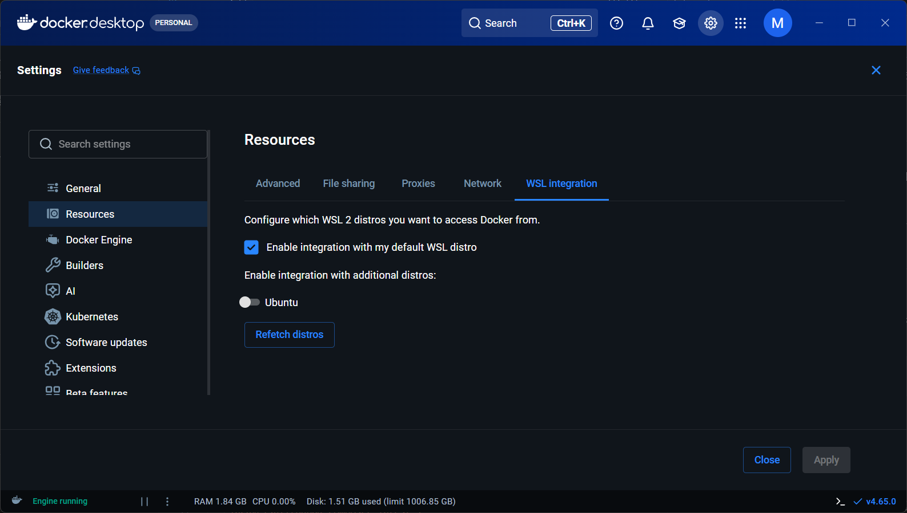

# Laravel 後端框架練習

此專案必須在 Linux 或 WSL2 中運行並操作，不可使用 Powershell。


## 目錄

* [Prerequisites](#prerequisites)
* [安裝步驟](#安裝步驟)
* [常用指令](#常用指令)

## Prerequisites

在開始前，你會需要在電腦上安裝好 `Docker Desktop`，安裝請參考 [Docker官方文件](https://docs.docker.com/get-started/get-docker/)。並且在 `Settings => Resources => WSL Integration` 中啟用以下功能:

* ✅ Enable integration with my default WSL distro



## 安裝步驟

**以下步驟均須在專案根目錄中執行。**

### 1. 複製環境變數檔案

我們需要複製一個全新的 `.env` 檔案，因為是機密檔案，所以不會加入 Git 版控:  

```bash
cp .env.example .env
```

### 2. 建立 Vendor 資料夾

你有兩個選擇:  

#### A. 使用 Docker 的 Composer 執行一次性安裝

這個指令會直接使用現成的 `Docker` 容器來運行 `PHP` 與 `Composer` 來將 `vendor` 資料夾下載完成，並且完成後會移除容器自身。

 ```bash
 docker run --rm \
    -u "$(id -u):$(id -g)" \
    -v "$(pwd):/var/www/html" \
    -w /var/www/html \
    laravelsail/php84-composer:latest \
    composer install --ignore-platform-reqs
 ```

#### B. 安裝全域 PHP 與 Composer

這個指令會一口氣把 `PHP 8.4` 與 `Composer` 安裝在作業系統中:

```bash
/bin/bash -c "$(curl -fsSL https://php.new/install/linux/8.4)"
```

然後下載 `vendor`:

```bash
composer install
```

上述兩種方法都可以將 `vendor` 下載下來。

### 3. 建構 Docker Image

開始建構此容器的 `Image`，這可能會需要花費幾分鐘的時間。

```bash
./vendor/bin/sail build --no-cache
```

### 4. 啟動 Sail 腳本

這個指令會運行自動啟動專案的容器。

```bash
./vendor/bin/sail up -d
```

### 5. 產生應用程式金鑰

因為 `.env` 是全新的，因此需要重新產生專屬金鑰:

```bash
./vendor/bin/sail artisan key:generate
```

### 6. 執行資料庫遷移

讓此專案能生成出正確的資料庫:

```bash
./vendor/bin/sail artisan migrate
```

### 7. 安裝 npm 套件

讀取 `package.json` 並下載依賴套件，生成 `node_modules` 目錄存放套件。

```bash
sail npm install
```

## 常用指令

此指令可以啟動容器:

```bash
./vendor/bin/sail up -d
```

參數 `-d` 作用是讓容器跑在背景，不占用此終端介面。

容器運行中時，可以透過瀏覽器輸入URL `localhost` 來存取網站，在 `env` 中可以透過新增 `APP_PORT=(your port)` 來修改監聽的 Port。

要進入容器內部作業系統的終端可以使用以下指令:

```bash
./vendor/bin/sail shell
```

要關閉容器時可以執行以下指令:

```bash
./vendor/bin/sail down
```

若是覺得 `./vendor/bin/sail` 很冗長，可以用以下別名:

```bash
alias sail='sh $([ -f sail ] && echo sail || echo vendor/bin/sail)'
```

這樣以後就可以用 `sail` 來代替 `./vendor/bin/sail`，但是這個重開終端機後就會消失，如果要永久啟用的話可以使用以下指令:

```bash
echo "alias sail='sh \$([ -f sail ] && echo sail || echo vendor/bin/sail)'" >> ~/.bashrc
source ~/.bashrc
```

啟動前端開發 Vite 伺服器，及時編譯並提供 CSS, JS 等資源，開發時使用。

```bash
sail npm run dev
```

執行 Vite 生產模式打包流程，將 CSS, JS, 圖片等資源壓縮並輸入到 `public/build`。

```bash
sail npm run build
```